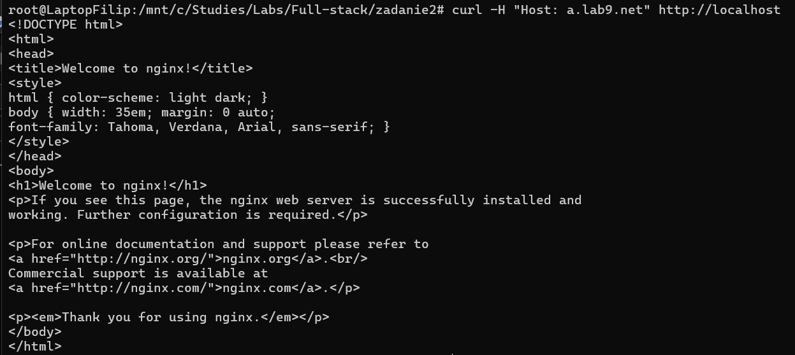
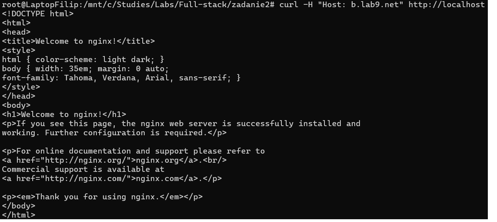
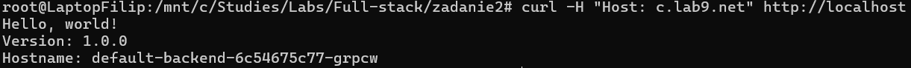

# Kubernetes Zadanie 2 - Programowanie full-stack w chmurze obliczeniowej

## Table of Contents
1. [Namespace Creation](#namespace-creation)
2. [Deployment and Service](#deployment-and-service)
3. [Ingress Configuration](#ingress-configuration)
4. [Network Policy](#network-policy)
5. [Testing](#testing)
6. [Conclusion](#conclusion)

---

## Namespace Creation

**Manifest: `namespaces.yaml`**
```yaml
apiVersion: v1
kind: Namespace
metadata:
  name: appns-a
---
apiVersion: v1
kind: Namespace
metadata:
  name: appns-b
```
**Command to apply:**
```bash
kubectl apply -f namespaces.yaml
```

---

## Deployment and Service

**Manifest: `app-a.yaml`**
```yaml
apiVersion: apps/v1
kind: Deployment
metadata:
  name: app-a
  namespace: appns-a
spec:
  replicas: 2
  selector:
    matchLabels:
      app: app-a-svc
  template:
    metadata:
      labels:
        app: app-a-svc
    spec:
      containers:
      - name: app-a
        image: nginx
        ports:
        - containerPort: 80
---
apiVersion: v1
kind: Service
metadata:
  name: app-a-svc
  namespace: appns-a
spec:
  selector:
    app: app-a-svc
  ports:
  - protocol: TCP
    port: 80
    targetPort: 80
```

**Manifest: `app-b.yaml`**
```yaml
apiVersion: apps/v1
kind: Deployment
metadata:
  name: app-b
  namespace: appns-b
spec:
  replicas: 2
  selector:
    matchLabels:
      app: app-b-svc
  template:
    metadata:
      labels:
        app: app-b-svc
    spec:
      containers:
      - name: app-b
        image: nginx
        ports:
        - containerPort: 80
---
apiVersion: v1
kind: Service
metadata:
  name: app-b-svc
  namespace: appns-b
spec:
  selector:
    app: app-b-svc
  ports:
  - protocol: TCP
    port: 80
    targetPort: 80
```
**Commands to apply:**
```bash
kubectl apply -f app-a.yaml
kubectl apply -f app-b.yaml
```

---

## Ingress Configuration

**Manifest: `ingress.yaml`**
```yaml
apiVersion: networking.k8s.io/v1
kind: Ingress
metadata:
  name: app-a-ingress
  namespace: appns-a
spec:
  ingressClassName: nginx
  rules:
  - host: a.lab9.net
    http:
      paths:
      - path: /
        pathType: Prefix
        backend:
          service:
            name: app-a-svc
            port:
              number: 80
---
apiVersion: networking.k8s.io/v1
kind: Ingress
metadata:
  name: app-b-ingress
  namespace: appns-b
spec:
  ingressClassName: nginx
  rules:
  - host: b.lab9.net
    http:
      paths:
      - path: /
        pathType: Prefix
        backend:
          service:
            name: app-b-svc
            port:
              number: 80
---
apiVersion: networking.k8s.io/v1
kind: Ingress
metadata:
  name: default-backend-ingress
  namespace: default
spec:
  ingressClassName: nginx
  defaultBackend:
    service:
      name: default-backend
      port:
        number: 80
```
**Command to apply:**
```bash
kubectl apply -f ingress.yaml
```

## Network Policy

**Manifest: `networkpolicies.yaml`**
```yaml
apiVersion: networking.k8s.io/v1
kind: NetworkPolicy
metadata:
  name: deny-between-namespaces
  namespace: appns-a
spec:
  podSelector: {}
  ingress:
    - from:
        - namespaceSelector:
            matchLabels:
              app.kubernetes.io/name: ingress-nginx
  egress:
    - to:
        - namespaceSelector:
            matchLabels:
              kubernetes.io/metadata.name: appns-b
---
apiVersion: networking.k8s.io/v1
kind: NetworkPolicy
metadata:
  name: deny-between-namespaces
  namespace: appns-b
spec:
  podSelector: {}
  ingress:
    - from:
        - namespaceSelector:
            matchLabels:
              app.kubernetes.io/name: ingress-nginx
  egress:
    - to:
        - namespaceSelector:
            matchLabels:
              kubernetes.io/metadata.name: appns-a
```
**Command to apply:**
```bash
kubectl apply -f networkpolicies.yaml
```

## Testing

**Command to apply:**
```bash
curl -H "Host: a.lab9.net" http://localhost
```


**Command to apply:**
```bash
curl -H "Host: b.lab9.net" http://localhost
```


**Command to apply:**
```bash
curl -H "Host: c.lab9.net" http://localhost
```


## Conclusion
In this task, two applications, app-a and app-b, were deployed in a Kubernetes cluster with two replicas each, running in their respective namespaces, appns-a and appns-b. Network policies were created to prevent communication between the applications in the two namespaces. To enable external access to the applications, an Nginx Ingress Controller was used, with Ingress resources configured for both applications. app-a was made accessible via a.lab9.net, and app-b via b.lab9.net. A default backend was also set up to redirect to a hello-app:1.0 Deployment when no Ingress rule is matched. The configuration files for Deployments, Services, Ingress, Network Policies, and namespaces were created and applied to the cluster, with testing to confirm the functionality.
