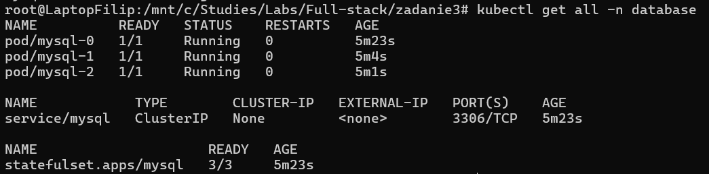
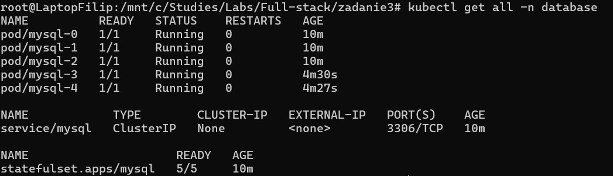
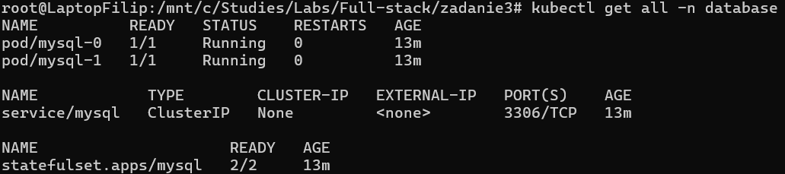

# Kubernetes Zadanie 3 - Programowanie full-stack w chmurze obliczeniowej

## Table of Contents
1. [Difference Between Scaling StatefulSet and Deployment](#difference-between-scaling-statefulset-and-deployment)
2. [Manifest Files for Deploying MySQL Using StatefulSet](#manifest-files-for-deploying-mysql-using-statefulset)
3. [Demonstrating Scaling Principles](#demonstrating-scaling-principles)

---

## Difference Between Scaling StatefulSet and Deployment

StatefulSet and Deployment are Kubernetes controllers that manage pod scaling, but they differ significantly in handling state and order.
1. **Scaling Up:**
   - **StatefulSet:** Pods are created sequentially (ordered), ensuring each pod gets its persistent storage and retains a unique identity (e.g., pod-0, pod-1, etc.). This is crucial for stateful applications like databases.
   - **Deployment:** Pods are created in parallel with no specific order or identity, making it ideal for stateless applications.
2. **Scaling Down:**
   - **StatefulSet:** Pods are deleted in reverse order (pod-2 before pod-1), ensuring the proper teardown of dependent resources or processes.
   - **Deployment:** Pods are deleted randomly without any regard to order.

---

## Manifest Files for Deploying MySQL Using StatefulSet

**Manifest: `stateful-mysql.yaml`**
```yaml
# Namespace
apiVersion: v1
kind: Namespace
metadata:
  name: database
---
# Persistent Volume Claim
apiVersion: v1
kind: PersistentVolumeClaim
metadata:
  name: mysql-pvc
  namespace: database
spec:
  accessModes:
  - ReadWriteOnce
  resources:
    requests:
      storage: 1Gi
---
# StatefulSet
apiVersion: apps/v1
kind: StatefulSet
metadata:
  name: mysql
  namespace: database
spec:
  serviceName: mysql
  replicas: 3
  selector:
    matchLabels:
      app: mysql
  template:
    metadata:
      labels:
        app: mysql
    spec:
      containers:
      - name: mysql
        image: mysql:5.7
        ports:
        - containerPort: 3306
          name: mysql
        env:
        - name: MYSQL_ROOT_PASSWORD
          value: rootpassword
        volumeMounts:
        - name: mysql-data
          mountPath: /var/lib/mysql
  volumeClaimTemplates:
  - metadata:
      name: mysql-data
    spec:
      accessModes: ["ReadWriteOnce"]
      resources:
        requests:
          storage: 1Gi
---
# Headless Service for MySQL StatefulSet
apiVersion: v1
kind: Service
metadata:
  name: mysql
  namespace: database
spec:
  ports:
  - port: 3306
    name: mysql
  clusterIP: None
  selector:
    app: mysql
```
**Command to apply:**
```bash
kubectl apply -f stateful-mysql.yaml
```

---

## Demonstrating Scaling Principles
**Before scaling**


**Command to apply for scale up:**
```bash
kubectl scale statefulset mysql --replicas=5 -n database
```

**After scaling up**


**Command to apply for scale down:**
```bash
kubectl scale statefulset mysql --replicas=2 -n database
```

**After scaling down**

