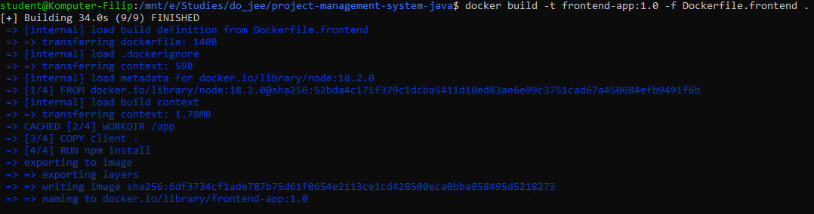

# Kubernetes Zadanie 4 (Wdrożenie aplikacji) - Programowanie full-stack w chmurze obliczeniowej

## Table of Contents
1. [General informations](#general-informations)
2. [Manifest files](#manifest-files)
3. [Project implementation](#project-implementation)

---


## General informations
**1. Stack:** (RMS)

 - R - React <br/> 
 - M - MongoDB <br/> 
 - S - Spring Boot <br/>

**2. Deployment assumptions:**

 - **Deployment platform:** Kubernetes environment
 - **Container Orchestration:** All components (frontend, backend, database) will be containerized using Docker and managed by Kubernetes
 - **Availability and Scalability:** Components will be deployed as Kubernetes Deployments to ensure automatic restart of pods in case of failure
 - **Access Methods:** Exposed to external users via **Ingress** with a domain name (e.g., `http://localhost`).

**3. Necessary resources:**
- **Dockerfiles:** Docker files required to create Docker images for backend and frontend application
- **Namespace:** Separate namespace for full-stack application
- **Network Policies:** To secure internal communication
- **Deployments:** For React frontend and Spring Boot backend
- **Services:** For frontend, backend and Mongo database
- **StatefulSet:** To ensures that each pod has a stable and unique identity
- **Ingress Controller:** To manage external traffic

---

## Manifest Files

**Manifest for backend docker image: `Dockerfile.backend`**
```yaml
FROM openjdk:17

WORKDIR /app

COPY /server/target/*.jar app.jar

CMD ["java", "-jar", "app.jar"]
```

**Manifest for frontend docker image: `Dockerfile.frontend`**
```yaml
FROM node:18.2.0

WORKDIR /app

COPY client .

RUN npm install

CMD ["npm", "start"]
```

**Manifest for namespace: `k8s_namespaces.yaml`**
```yaml
apiVersion: v1
kind: Namespace
metadata:
  name: fullstack-app
```

**Manifest for network policy: `k8s_network.yaml`**
```yaml
apiVersion: networking.k8s.io/v1
kind: NetworkPolicy
metadata:
  name: allow-in-namespace
  namespace: fullstack-app
spec:
  podSelector: {}
  policyTypes:
    - Ingress
  ingress:
    - from:
      - namespaceSelector: {}
        podSelector: {}
```

**Manifest for backend deploy: `k8s_backend_deploy.yaml`**
```yaml
apiVersion: apps/v1
kind: Deployment
metadata:
  name: java-app
  namespace: fullstack-app
  labels:
    app: java-app
spec:
  replicas: 1
  selector:
    matchLabels:
      app: java-app
  template:
    metadata:
      labels:
        app: java-app
    spec:
      containers:
      - name: java-app
        image: backend-app:1.0
        ports:
        - containerPort: 8080
        env:
        - name: SPRING_DATA_MONGODB_DATABASE
          value: project-management-system-database
        - name: SPRING_DATA_MONGODB_PORT
          value: "27017"
        - name: SPRING_DATA_MONGODB_HOST
          value: mongo-db.fullstack-app.svc.cluster.local
```

**Manifest for backend service: `k8s_backend_service.yaml`**
```yaml
apiVersion: v1
kind: Service
metadata:
  name: java-app
  namespace: fullstack-app
spec:
  selector:
    app: java-app
  ports:
    - protocol: TCP
      port: 8080
      targetPort: 8080
```

**Manifest for frontend deploy: `k8s_frontend_deploy.yaml`**
```yaml
apiVersion: apps/v1
kind: Deployment
metadata:
  name: react-app
  namespace: fullstack-app
  labels:
    app: react-app
spec:
  replicas: 1
  selector:
    matchLabels:
      app: react-app
  template:
    metadata:
      labels:
        app: react-app
    spec:
      containers:
      - name: react-app
        image: frontend-app:1.0
        ports:
        - containerPort: 3000
```


**Manifest for frontend service: `k8s_frontend_service.yaml`**
```yaml
apiVersion: v1
kind: Service
metadata:
  name: react-app
  namespace: fullstack-app
spec:
  selector:
    app: react-app
  ports:
  - name: react-app
    protocol: TCP
    port: 3000
    targetPort: 3000
```

**Manifest for database statefulset: `k8s_database_statefulset.yaml`**
```yaml
apiVersion: apps/v1
kind: StatefulSet
metadata:
  name: mongodb-statefulset
  namespace: fullstack-app
spec:
  serviceName: mongodb-service
  replicas: 1
  selector:
    matchLabels:
      app: mongodb
  template:
    metadata:
      labels:
        app: mongodb
    spec:
      containers:
      - name: mongodb
        image: mongo:latest
        ports:
        - containerPort: 27017
        volumeMounts:
        - name: mongodb-data
          mountPath: /var/lib/mongodb/data
  volumeClaimTemplates:
  - metadata:
      name: mongodb-data
    spec:
      accessModes: [ "ReadWriteOnce" ]
      resources:
        requests:
          storage: 1Gi
```

**Manifest for database service: `k8s_database_service.yaml`**
```yaml
apiVersion: v1
kind: Service
metadata:
  name: mongodb-service
  namespace: fullstack-app
  labels:
    app: mongodb
spec:
  ports:
  - port: 27017
    name: mongodb
  clusterIP: None
  selector:
    app: mongodb
```


**Manifest for ingress: `k8s_ingress.yaml`**
```yaml
apiVersion: networking.k8s.io/v1
kind: Ingress
metadata:
  name: project-ingress
  namespace: fullstack-app
spec:
  ingressClassName: nginx
  rules:
  - http:
      paths:
      - path: /api
        pathType: Prefix
        backend:
          service:
            name: java-app
            port:
              number: 8080
      - path: /
        pathType: Prefix
        backend:
          service:
            name: react-app
            port:
              number: 3000
```

## Project implementation
**Building docker image for backend (command to apply):**
```bash
docker build -t backend-app:1.0 -f Dockerfile.backend .
```


**Building docker image for frontend (command to apply):**
```bash
docker build -t frontend-app:1.0 -f Dockerfile.frontend .
```


**Running manifest files:**
```bash
kubectl apply -f k8s
```


**Getting informations about running files:**
```bash
kubectl get all,ingress -n fullstack-app
```


**Starting minikube tunnel (in another terminal):**
```bash
minikube tunnel
```


### Working application:


